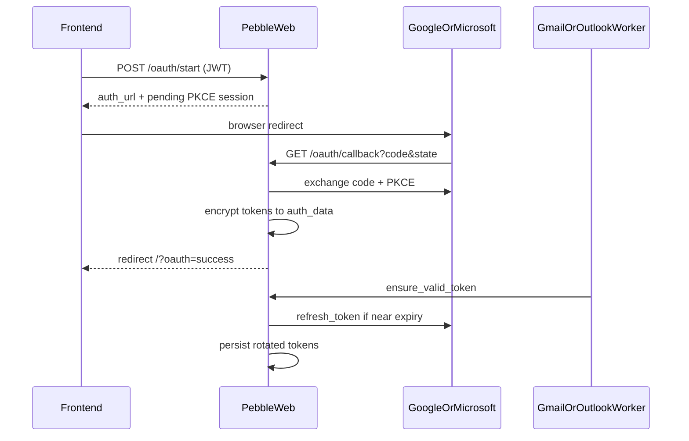

# Web 端 OAuth2 邮箱登录实现计划

## 先回答你的三个问题

**Token 多久有效？**

- **Access token**：Google / Microsoft 通常约 **1 小时**（`expires_in ≈ 3600`）。
- **Refresh token**：长期有效（直到用户撤销或策略失效）；微软在带 `offline_access` 时还会**轮换** refresh token，每次刷新后都要写回存储。

**要后台自动刷新吗？**

- **要。** 否则约 1 小时后同步/发信就会 401。

**现有刷新机制？**

- 邮件层已有，Web 未接通：
  - `[GmailSyncWorker](crates/pebble-mail/src/gmail_sync.rs)` / `[OutlookSyncWorker](crates/pebble-mail/src/outlook_sync.rs)` 的 `ensure_valid_token()`：到期前（Gmail 约 5 分钟、Outlook 约 60 秒缓冲）调用 `TokenRefresher`
  - `[pebble_oauth::OAuthManager::refresh_token](crates/pebble-oauth/src/lib.rs)`
  - 桌面版 `[build_oauth_token_refresher](https://github.com/QingJ01/Pebble/blob/master/src-tauri/src/commands/oauth.rs)`：刷新后加密写回 `accounts.auth_data`
- Web 当前 `[src/sync.rs](src/sync.rs)` **只起 IMAP worker**，且明确跳过非 IMAP 账号；`[completeOAuthFlow](frontend/src/lib/api.ts)` 直接抛错。

## 实现范围（默认）

同时支持 **Gmail + Outlook**（与桌面版、Issue #7 对齐）。IMAP 密码添加方式保留。

## 架构决策

- **回调模型**：服务端 Authorization Code + PKCE；回调 URL 为 `{PEBBLE_PUBLIC_URL}/api/v1/oauth/callback`（不能用桌面版 `127.0.0.1` 监听）。
- **配置**：`GOOGLE_CLIENT_ID`/`SECRET`、`MICROSOFT_CLIENT_ID`/`SECRET`、`PEBBLE_PUBLIC_URL`（必填才能启用 OAuth）。
- **应用注册**：用户需在 Google/Azure 注册 **Web** 应用，并把上述 callback 配进 redirect URI（桌面 Desktop/Native 客户端通常不够）。
- **会话**：`POST /oauth/start`（需 JWT）生成 PKCE，把 pending session（state、verifier、provider、过期时间）放内存 Map；callback 用 state 校验，**不依赖**浏览器再带 JWT。
- **存储**：对齐桌面，token 加密写入 `accounts.auth_data`；`provider` 设为 `gmail`/`outlook`；`sync_state.provider` 写入 slug。

## 后端改动

1. **扩展** `[crates/pebble-oauth](crates/pebble-oauth/src/lib.rs)`：`OAuthConfig` 增加可选 `redirect_uri`；有值时用它，否则保持现有 `http://127.0.0.1:{port}/callback`。
2. **依赖**：根 `[Cargo.toml](Cargo.toml)` 为 `pebble-web` 增加 `pebble-oauth`。
3. **配置** `[src/config.rs](src/config.rs)`：读入 OAuth 客户端与 `PEBBLE_PUBLIC_URL`。
4. **新模块** `src/oauth.rs`（移植桌面 `oauth.rs` 精简版）：
  - `gmail_oauth_config` / `outlook_oauth_config`（scopes 与桌面一致，含 Microsoft `offline_access`）
  - `fetch_userinfo`、`persist` / `decode` auth_data、`build_oauth_token_refresher`
5. **路由** `[src/routes/oauth.rs](src/routes/)` + `[src/routes/mod.rs](src/routes/mod.rs)`：
  - `POST /api/v1/oauth/start`（受保护）→ `{ auth_url }`
  - `GET /api/v1/oauth/callback`（公开）→ 换 token、建账号、起 sync → 302 到 `/?oauth=success`
6. **同步** `[src/sync.rs](src/sync.rs)`：按 `provider` 启动 `GmailSyncWorker` / `OutlookSyncWorker`，挂上 `with_token_refresher`；去掉“跳过非 IMAP”。
7. **发信** `[src/routes/compose.rs](src/routes/compose.rs)`：OAuth 账号走 Gmail/Outlook API `send`（当前只读 IMAP SMTP，否则只能收不能发）。

## 前端改动

1. `[frontend/src/lib/api.ts](frontend/src/lib/api.ts)`：实现 `startOAuthFlow(provider)`；去掉/替换抛错的 `completeOAuthFlow`。
2. `[frontend/src/components/AccountSetup.tsx](frontend/src/components/AccountSetup.tsx)`：对齐桌面，增加 Google / Microsoft 登录按钮；点击后 `window.location = auth_url`。
3. 应用入口：检测 `?oauth=success`，刷新账号列表并 toast，然后清 query。
4. 文案：`en.json` / `zh.json` 增加相关 key。

## 配置文档

更新 `[.env.example](.env.example)`、`[README.md](README.md)`：列出 OAuth 环境变量、redirect URI 注册说明。未配置 client id 时，start 返回明确错误，UI 可提示“未配置 OAuth”。

## 不在本次范围

- OAuth 账号专用代理 UI（AccountsTab 里已有展示逻辑，可后续再接 API）
- 把桌面 localhost redirect 原样搬到 Web（不适用自托管远程访问）

